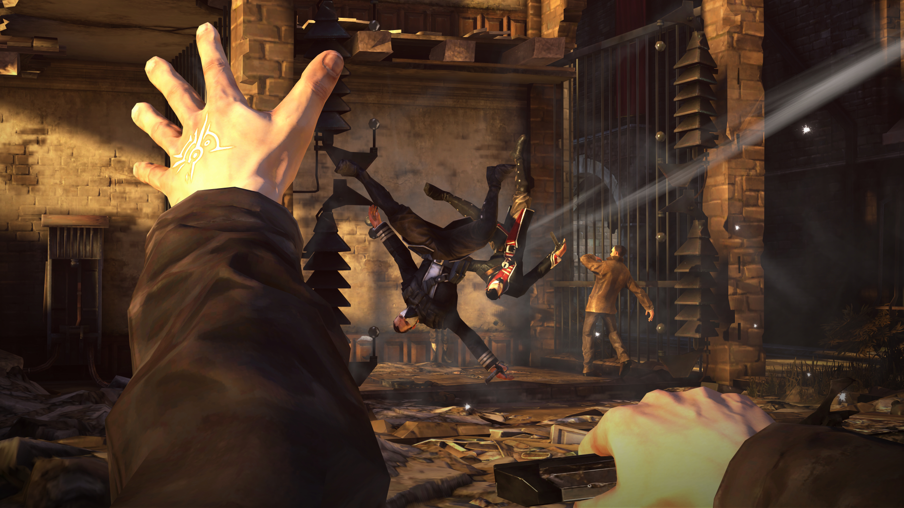
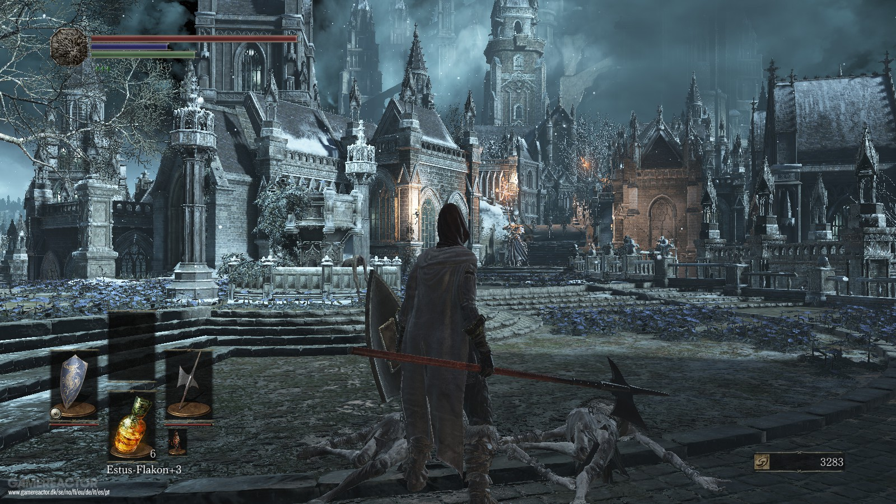

# WIP Name - Mistborn type game

## Genre - Action RPG

## Story - 
 - TBD

## Visuals -

- Game will take place in a 3D rendered environment
- Art stye tbd
- http://www.adriancourreges.com/blog/2017/12/15/mgs-v-graphics-study/
- ^^ lot to consider
- Modeling
- Textures
- Lighting
- Animations

## Gameplay - 
    
### Control
- First-person perspective or Third-person perspective

- WASD-movement
- Mouse camera control depending on camera style (locked to head or out of body)
- Mouse buttons and various keyboard inputs for actions
- Menus
- Dialogue controls

###     Movement

- Aside from basic movement, we'd want to include Steelpushing/Ironpulling.
- Sprint/Stamina
- autoclimb on ledges

###     Combat

- Melee: Knives/Swords
- Allomancy: 
    - Steel (Coinshot) Ranged attack, using nails/coins
    - Iron (Lurcher) Grab metal objects within range and fling at enemies
    - Pewter (Thug) Increase physical fighting ability for a time
    - Tin (Tineye) Give extrasensory perception of some sort
    - Zinc (Rioter) Enrage enemies
    - Brass (Soother) Calm enemies
    - Copper (Smoker) Hide Allomancy, essential against Mistborn and Seekers
    - Bronze (Seeker) Detect Allomancy
    - Atium ... Somehow make that work

###     Dialogue

###     Other general todo
- Out-of-game menus
- In-game menus
- Audio (SFX, VO?)
- Music??
- Save/Load states
- Level Design
- Items
- Skill Progression
- Tutorialization
